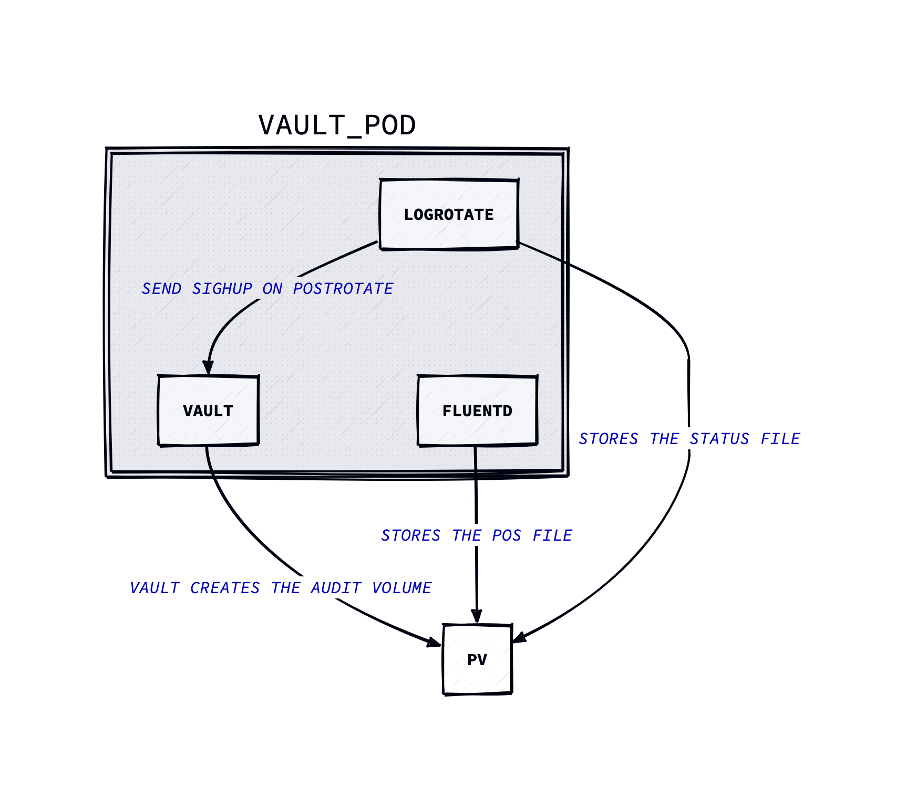

# vault-audit-log-fluentd

This repository contains example how to use file based audit logging device in Hashicorp Vault.

<p align="center">

</p>

## fluentd

This container will tail the audit log and also pushes the log to Azure Blob Storage. There is separate [Dockerfile](./fluentd/Dockerfile) for this that extends the Fluentd base image by installing the [fluent-plugin-azure-storage-append-blob](https://github.com/microsoft/fluent-plugin-azure-storage-append-blob) plugin. Fluentd will also write following files to the mounted audit path (default. `/vault/audit`) `audit.log.pos` to record the position it last read from the audit log. Also by default the Azure Blob Storage plugin will buffer the content of the log to a file path `/vault/audit/fluentdazblob` and will send them daily to Azure Blob Storage.

## logrotate

This is used to rotate the logs daily. You can check the program structure from [main.go](./main.go). It has following environment variables available to configure.

| Environment Variable          | Default Value      | Description                                                                               |
| ----------------------------- | ------------------ | ----------------------------------------------------------------------------------------- |
| `CRON_SCHEDULE`               | `"@daily"`         | Used to set the cron schedule. If not set, the schedule defaults to daily.                |
| `DEBUG`                       | ""                 | If set, the `-d` flag is added to the `logrotate` command arguments, enabling debug mode. |
| `LOG_ROTATE_STATUS_FILE_PATH` | "logrotate.status" | Path where to store the logrotate.status file                                             |

## Usage

Create Vault namespace

```bash
kubectl create ns vault
```

Create Configmaps to vault namespace

```bash
kubectl create configmap fluentd-config --from-file=./conf/fluent.conf -n vault
kubectl create configmap logrotate-config --from-file=./conf/logrotate.conf -n vault
```

Install Vault using Helm

```bash
helm repo add hashicorp https://helm.releases.hashicorp.com
helm repo update

helm upgrade --install --atomic vault hashicorp/vault -f ./helm/values.yaml -n vault
```

Initialize the Vault

```bash
kubectl exec -it vault-0 -n vault -- sh

vault operator init

# Unseal the Vault
vault operator unseal

VAULT_TOKEN=<root_token> vault audit enable file file_path=/vault/audit/audit.log
```
